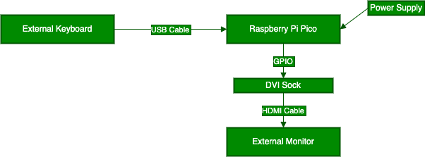

Cytrence Kiwi Snake Game Demonstration with Raspberry Pi Pico
=========================================

Here at Cytrence, we are revolutionizing how computers and microcontrollers interact with our portable laptops. The Kiwi allows you to connect all sorts of devices, from mini PCs to microcontrollers to your laptop, to act as an external monitor as well as utilize its keyboard and mouse functionality.

To showcase the Kiwi and its uses, we have created a simple snake game to demonstrate its capabilities and showcase the seamless integration of our device with the Raspberry Pi Pico. The game utilizes the TinyUSB library to handle keyboard inputs, allowing the player to control the snake using keyboard controls. The display is managed through a DVI connection, with the snake dynamically rendering graphics in real-time to the connected screen.

Traditional Setup with Raspberry Pi Pico
----------------------------------------
In a typical setup, you would connect a Raspberry Pi Pico with a DVI sock to an external monitor to display its graphics, and you would use an external keyboard to control the game.

While this setup works just fine, it is not portable and can be annoying to set up.

Simplified Setup with the Cytrence Kiwi
------------------------------
The Kiwi simplifies the setup drastically by allowing the user to use their laptop as the external monitor and its built-in keyboard to play the game. This completely gets rid of the need for two large peripherals and streamlines the setup.

With the Kiwi, the DVI sock from the Raspberry Pi Pico connects directly to the Kiwi and connects to the laptop. The snake game can now be played completely within the CytrenceKiwi application window, using your laptop’s keyboard for control.

Debugging Made Easy with UART
-----------------------------
Another powerful feature of the Kiwi is its ability to connect to any compatible device’s UART or serial port. This functionality is particularly useful for the development of microcontrollers. By connecting the UART Tx, Rx, and Gnd from the Raspberry Pi Pico to the Kiwi, you can easily display debug information on your laptop, streamlining the development and debugging processes. With all of the Uart connections set, you can open up the Kiwi's built in terminal and use it as an equivalent to PuTTY on Windows or screen/minicom on Mac OS.

While developing the snake game, the debug terminal was integral to checking initializations and I/O.

Cytrence Kiwi Frame Number Display with Raspberry Pi Pico
=========================================

This program is designed to run on the Raspberry Pi Pico and displays an incrementing frame number on a connected DVI display. The frame number starts from 0 and increments by 1 at a rate of 60 Hz. The display resolution is set to 320x240 pixels.

Features
--------
- Smooth Frame Rate: Displays frame numbers at a consistent 60 frames per second for smooth visuals.
- Dual-Core Processing: Utilizes both cores of the Raspberry Pi Pico to efficiently handle DVI output and framebuffer updates.
- Customizable Display Resolution: The display resolution is set to 320x240 pixels but can be modified to fit different screen sizes and DVI timing configurations.
- Adjustable Frame Intervals: Frame intervals are configurable, allowing for fine-tuning of display refresh rates:
  - FRAME_INTERVAL_1: Set to 16666 microseconds.
  - FRAME_INTERVAL_2: Set to 16667 microseconds.
- Configurable Maximum Number: The program allows customization of the maximum frame number (MAX_NUMBER) before resetting back to 0.
- Frame Count Target: The target number of frames (FRAME_COUNT_TARGET) can be set to measure performance over a defined interval.
- Efficient Framebuffer Management: Includes functions to initialize, reset, and update the framebuffer for dynamic and responsive display updates.
