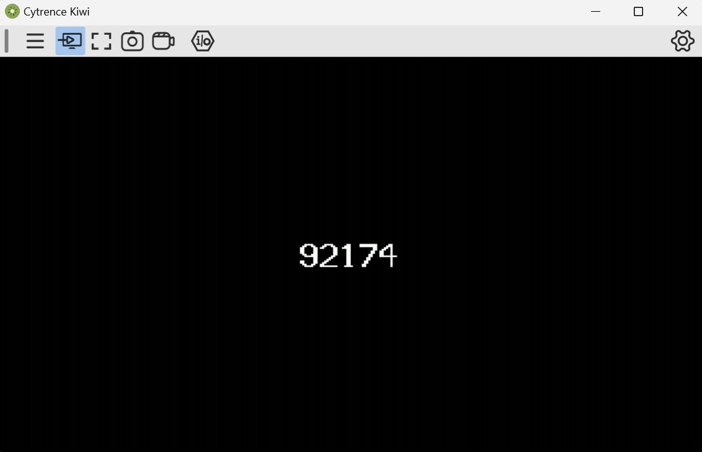

Frame Number Display for Raspberry Pi Pico
================================

Dependencies
------------
To build and run this project, you will need:

- Raspberry Pi Pico SDK
- arm-none-eabi-gcc

Building
--------
Use the VS Code shortcut that is created by the Pico SDK.

The easiest way to build the project is by using the "CMake" extension in VS Code.

Once you have all the packages and extensions installed, you can build everything by either clicking the CMake extension and clicking the build icon or by clicking "Build" on the status bar of VS Code.

Step-by-Step Instructions
-------------------------
1. Install dependencies
- Follow the instructions to install the Pico SDK from the official documentation.
- Install arm-none-eabi-gcc toolchain from ARM's official site.

2. Clone the repository 
- Make sure to include the "libdvi" submodule to display graphics

3. Set Up the Environment
- Ensure that the PICO_SDK_PATH environment variable is set correctly
- export PICO_SDK_PATH=/path/to/pico-sdk

4. Build the Project
- If on Windows, use the VS Code shortcut created by the Pico SDK. If on Mac, make sure you have the path of the Pico SDK correctly referenced.  
- Configure the project using CMake: Ctrl + Shift + P -> CMake: Configure.
- Build the project

5. Flash the firmware
- Hold the BOOTSEL button down on the Pico and plug it into a USB port
- Copy the generated UF2 file to the Pico

Running the Game
----------------
After flashing the firmware, the frame number display will start automatically. The display will show the current frame number, which increments at 60 Hz.

Code Overview
-------------
Here is a brief overview of the main components of the code:

- main.c: Contains the main program logic, including framebuffer initialization, DVI output configuration, and the main loop for updating and displaying the frame number.
- bitmap.h: Defines bitmap representations for digits 0-9 and a space using an 8x16 grid for each character.
- CMakeLists.txt: CMake build configuration file.
- pico_sdk_import.cmake: Imports the Pico SDK.
- libdvi submodule: Provides the DVI output functionality, including:
  - dvi.h, dvi_serialiser.h, common_dvi_pin_configs.h, tmds_encode.h: Libraries from the PicoDVI library for handling DVI output.
